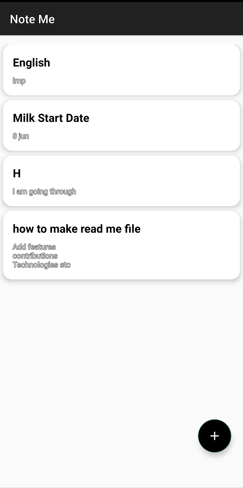
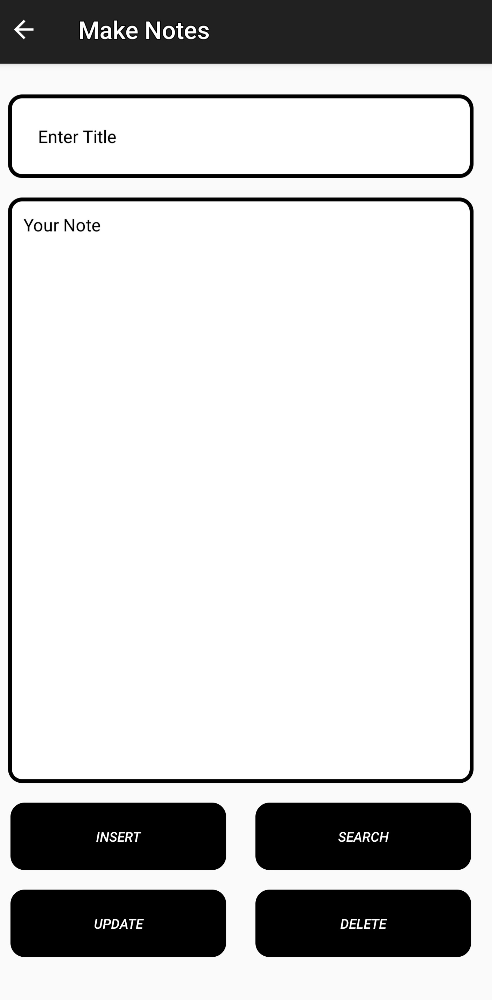

# Note-Taking App

## Description
A simple note-taking app for Android developed using Java and SQLite. The app supports basic CRUD (Create, Read, Update, Delete) operations for managing notes.

## Features
- Create, read, update, and delete notes.
- Store notes locally using SQLite.
- User-friendly interface.

## Technologies Used
- **Java:** Programming language for Android development.
- **XML:** Used for designing the UI layout.
- **SQLite:** Local database for storing notes.
- **Android Studio:** IDE for developing Android applications.

## Installation
To run this app on your local machine, follow these steps:

1. **Clone the repository:**
    ```sh
    git clone https://github.com/awais1019/Note-Taking-App.git
    ```
    
2. **Open the project in Android Studio:**
    - Launch Android Studio.
    - Select "Open an existing Android Studio project."
    - Navigate to the cloned repository and select it.
    
3. **Build the project:**
    - Let Android Studio download the necessary dependencies.
    - Click "Build" > "Make Project" or press `Ctrl+F9`.
    
4. **Run the app:**
    - Connect an Android device or start an emulator.
    - Click "Run" > "Run 'app'" or press `Shift+F10`.

## Screenshots

<div style="display: flex;">
  
  
</div>


## Contributing
Contributions are welcome! Please open an issue or submit a pull request.

## License
This project is licensed under the MIT License.

## Contact Information
For any questions or feedback, please reach out to:
- Email: mhawais504@gmail.com
- GitHub: https://github.com/awais1019
